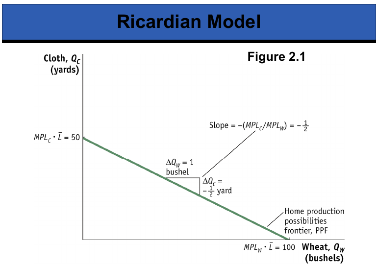
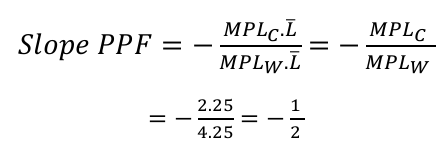
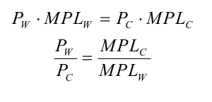
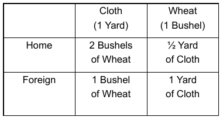
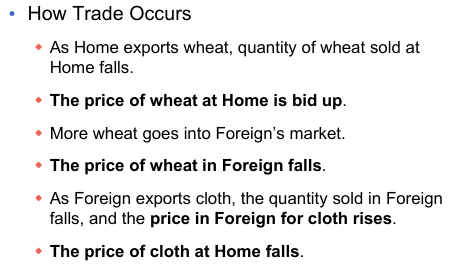
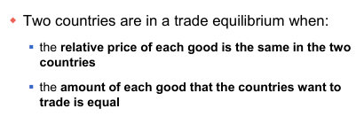
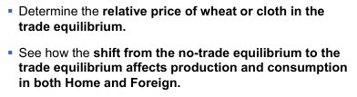
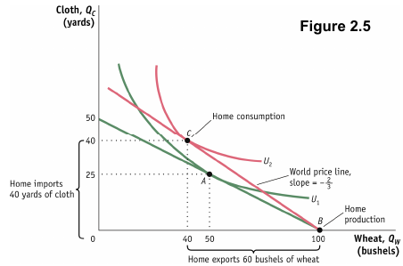
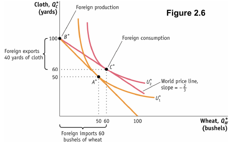

At home, the central planner's problem is

\[ \underset{c,w}{\max}\ U(c,w)\text{ s. to MPL}_w=4\text{, MPL}_c=2\text{, }\overline{\text{L}}=25.\]

Abroad, the foreign problem is

\[ \underset{c^*,w^*}{\max}\ U(c^*,w^*)\text{ s. to MPL}_w^*=1\text{, MPL}_c^*=1\text{, }\overline{\text{L}}=100.\]

We have three resource constraints. The first two constraints are technology constraints. The last constraint is the endowment.

Even though the first country has an absolute advantage in both goods, it will end up specializing nonetheless.

The slope of the PPF above is given by the following:

Remember that autarky is a state of closeness. No trade in this case.

In this interesting to note that we could have stated the initial problem with prices.

In the central planner's problem, we assume that there is an agent that can set all parameters of the economy.

Let us now look at a competitive market. A representative consumer is one out the millions of the consumers in the economy. Given that there are so many, they will be price takers. The representative consumer's problem is

\[ \underset{c,w}{\max}\ U(c,w)\text{ s. to }m=p_cc+p_ww.\]

In this economy, there will be infinite firms of two types: the ones that produce $c$ and the ones that produce $w$. The firms will try to maximize profits. The problem of a representative firm's is

\[ \underset{y_i}{\max}\ \pi_i=p_iy_i-wL_i\text{ s. to }y_i=f_i(L_i)\quad (i=c,w).\]

We solve this problem via the FOC:

$p_i\cdot\frac{dy_i}{dL_i}=w\Leftrightarrow p_i\cdot\text{MPL}_i=w.$

Why no subscript in the $w$? We are assuming that we have labor mobility in this country so that workers can choose industries. Even though they cannot migrate to another country, they will choose the industry that pays the highest. For this reason the wages will end up being equal, not depending on the industry.

Wages will be the same in the whole country as:

This is how we derive the optimal point in autarky. The slope at autarky will be equal to the price ratio. If we are asked what is the price ratio of $w$ over $c$, we just have to calculate $\text{MPL}_c$ over $\text{MPL}_w$. The price mechanism results of different levels of technologies.

By looking only at the $\text{MPL}$ of both countries and both industries, we are able to say what the patterns of trade will be.

When we open to trade, prices may change.

In this model, we won't have results for absolute prices, just relative.

We will study two problems:

Trade will be positive as agents will derive higher utility from trade.

x`
