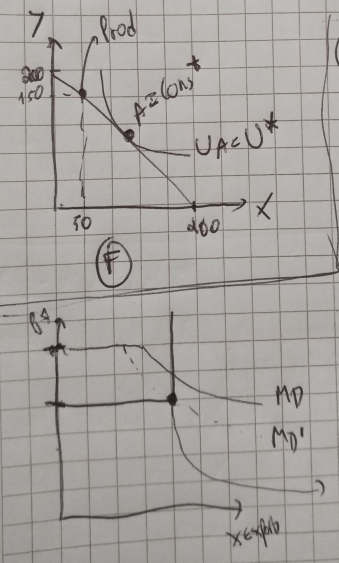
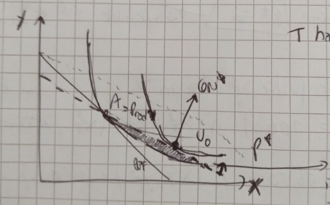

**1.e) Find the free trade equilibrium price. Is there complete specialization in both countries? Who gains from trade.**

We already know that $(x_H,y_H)=(50,25)$, $(x_F,y_F)=(50,50)$, $p^H=1/2$, and $p^F=1$. The PPFs are:
- $\text{PPF}^H:\ y=50-\frac{1}{2}x$
- $\text{PPF}^F:\ y=100-x$

Let us assume that both countries fully specialize:
Production will be:
- $(x_H^P,y_H^P)=(100,0)$
- $(x_H^D,y_H^D)=(0,100)$

We can check last class' derivation as:

$\begin{cases} \text{MRS}=P^*\\
P^*x_C+y_C=P^*x_P+y_P \end{cases}$

Consumption will be:
- $(x_H^C,y_H^C)=(\frac{p^*x_H^P+y_H^P}{2p^*},\frac{p^*x_H^P+y_H^P}{2})=(50,50P^*)$
- $(x_F^C,y_F^C)=(\frac{p^*x_F^P+y_F^P}{2p^*},\frac{p^*x_F^P+y_F^P}{2})=(\frac{50}{P^*},50)$

We have that:
- XS: $x_H^P-x_H^C=100-50=50$
- MD: $x_F^C-c_F^P=\frac{50}{P^*}$

We do $S=D$ to check the equilibrium in the international market:
$$XS=MD\Leftrightarrow50=\frac{50}{P^*}\Leftrightarrow P^*=1$$

F is a large economy. It has no gains from trade.

*Add graph of $x$, exports, by $P^*$ (with a rectangle angle in black)*

*Add graphs of gains from trade for *H* and *F*; the axis are $x$-$y$*

In the foreign country, the slope of the PPF that is the price ratio in autarky won't change and for that reason the utility won't change.

**Extra question: Repeat the previous question, but now assuming that Foreign had initially $200$ workers, not $100$.**

$F$ is bigger. Competitive advantage is the same.

Let us assume that both countries fully specialize:
- New $\text{PPF}^F:\ y=200-x$

Production will be:
- $(x_h^P,y_h^P)=(100,0)$
- $(x_h^D,y_h^D)=(0,200)$

Consumption will be:
- $(x_H^C,y_H^C)=(\frac{p^*x_H^P+y_H^P}{2p^*},\frac{p^*x_H^P+y_H^P}{2})=(50,50P^*)$
- $(x_F^C,y_F^C)=(\frac{p^*x_F^P+y_F^P}{2p^*},\frac{p^*x_F^P+y_F^P}{2})=(\frac{100}{P^*},100)$

We can go and check for the experts supply and import demand:
- XS: $x_H^P-x_H^C=100-50=50$
- MD: $x_F^C-c_F^P=\frac{100}{P^*}$

We do $S=D$ to check the equilibrium in the international market:
$$XS=MD\Leftrightarrow50=\frac{100}{P^*}\Leftrightarrow P^*=2$$

This new price is impossible as the interantional price should lie in the interval of the autarky prices of $H$ and $F$. That is, the $P^*\not\in\left[\frac{1}{2},1\right]$.

*Plot the new diagram for the price of $x$*

This cannot happen: out initial assumption of full specialization is wrong.

Let us look at productions:
- $(x_H^P,y_H^P)=(100,0)$
- $(x_F^P,y_F^P)=(x_F^P,200-x_F^P)$

And consumption:
- $(x_H^C,y_H^C)=(50,50)$
- $(x_F^C,y_F^C)=(100,100)$

$H$ will export $50$ of $x$ to $F$, but $F$ wants to consume $100 \ \implies\ x_F^P=50$.
$F$ demands $100$ of $y$ and $H$ demands $50\ \implies\ y_F^P=150$.

*This is what we need to know about large countries in the Ricardian model.*
****
**2.g.  Consider that each unit of labor $\dots$**

What we need to know is that:
- $U=xy$
- $\overline{L}_S=24$
- $\overline{L}_L=18$
- $\text{PPF}^S$: $y=\frac{\overline{L}_S}{3}-2x$
- $\text{PPF}^L$: $y=\overline{L}_L-3x$
- $P^S=2$
- $P^L=3$

If $S$ is large $P^*=P^S=2$.
$L$ will be small, fully specializes in $y$.
- Production: $(x_L^P,y^P_L)=(0,\overline{L}_L)$
- Consumption: $(x_L^C,y_L^C)=(\frac{p^*x_L^P+y_L^P}{2p^*},\frac{p^*x_L^P+y_L^P}{2})=(\frac{\overline{L}_L}{4},\frac{\overline{L}_L}{2})$

*Add graph of $x$ Exports by $P^*$*

Wee need to find out the point at the corner so that we get the minimum point where $S$ is a large point.

$S$ will fully specialize:
- Production: $(x_S^P,y^P_S)=(\frac{\overline{L}_S}{6},0)$
- Consumption: $(x_S^C,y_S^C)=(\frac{p^*x_S^P+y_S^P}{2p^*},\frac{p^*x_S^P+y_S^P}{2})=(\frac{\overline{L}_L}{12},\frac{\overline{L}_L}{6})$

By looking at the exports:
- XS: $x_S^P-x_S^C=\frac{\overline{L}_S}{12}$
- MD: $x_L^C-x_L^P=\frac{\overline{L}_L}{4}$

By clearing the international market:
$$\text{XS}=\text{MD}\Leftrightarrow\overline{L}_S=31.5$$

The $\Delta\overline{L}_S=31.5-24=7.5$ million workers migrate from $L$ to $S$.

Before:
- $U_S=12$
- $U_L=27$
After:
- $U_S=13.78$
- $U_L=13.78$

****

**2. $\dots$**

There might not be gains from specialization but there might exist grains from trade.

*Add graph with x-y axis where the PPF changes due to gains from trade as we have a new slope*

Our $\text{PPF}$ intersects the old point as the labor force is inelastic. Can we consume at a higher utility with this new slope? Yes, as we gain from trade. The *blue area* constitutes the better set of consumption under international trade.

There are no gains from specialization, but there are gains from exchange. We are not specializing at all, we are simply benefiting from an international market.
