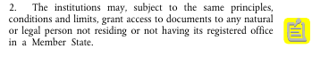

Email - catarina.amaral@novasbe.pt

What is a person?

**Positive injunction** - Affirmative injunction refers to an injunction that requires a positive act on the part of the defendant. Outside divorce, most injunctions are negative. Injunction is an equitable remedy in the form of a court order compelling a party to do or refrain from doing a specified act. The ECJ can only say that you got a 'No' illegally.

Distinction between legal personalty and legal capacity? As soon as you turn 18, you can exercise your rights without the help of a mother or a tutor. You gain legal capacity. Legal personality is who you are. Legal capacity is basically the capacity to exercise those right given to you.

The first stage of the application is to know who is a person. If you are, you pass to the second stage: who is a beneficiary? There are two types of beneficiaries.

The first article tells us **beneficiaries by right!**

Mulan fits into the second category as she can apply by grace even though she is Chinese living in China. she is a **beneficiary by grace!**

If a person is a beneficiary it doesn't necessarily mean it is an applicant. The person only becomes an applicant when the person, as a beneficiary, applies.

Whenever an institution gets an application, it is from that moment on called **addressee**.

The passage above was problematic.

There are differences in the rights that applicants by right or by grace. *Check powerpoint's table.*

The scheme is:
$$\text{Request}\rightarrow\text{Confirmatory Request}\rightarrow\text{EU Court}$$

The case T 124/96 Interporc comes following the 174/95 case. In the first case we have that we have a wide access and we do not have to explain and justify why we want the access to a document. We don't have to justify to the court. No institution can ask you for justification.

The Common law is that we have to justify a direct and precise interest.

Here we have a first departure of EU law as Common Law is not necessarily followed.

Even though we get the 2 tier separation of beneficiaries by right and grace, you don't need to try to be a beneficiary by grace as one can simply ask an EU citizen to apply to access to documents.

Profiles of applicants via:
1. Official Statistics;
2. Rational Applicants - those who seek annulment;
3. Stubborn Applicant - because the court cannot tell the institution to give the document to the applicant as it can only say that it was illegal. There is the absence of injunction.

When an institution is showing inertia, the EU court cannot do anything about it. Same thing happens when the institution does not want to give access to a document. With rational applicants we know that they will not leave the process with the documents that they intended on having.

### Conclusion
To see if someone has a legal personality you go and see the law of the member state. We can have beneficiaries by right or grace. Once the beneficiaries apply, they become applicants. The institution gets an application, it is called addressee.

The profiles can give an interesting insight on the access policy.

On expectations, the courts have a very shallow as they cannot enforce institutions to give. There are therefore very shallow remedies available to applicants. There is no positive injuction.
