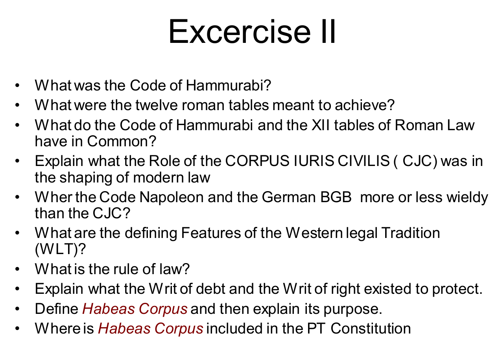

# 1 Introduction
## 1.1 Introduction

What is the meaning of "Jus"?
Law.

What is the meaning of "Ab origine" or "Ab initio"?
"From the origin" or "From the beginning."

What is the meaning of "Abundantia Cordis"?
With magnificence of heart, with abundance of sincerity and frankness (you only learn if you commit yourself).

What is the meaning of "De Lege Lata" or "De Lege Data"?
This means the concrete solution that a given legal system has adopted for the given legal problem, only lawyers know what it is, the public has vague and general impressions that are not based on any real knowledge.

What is the meaning of "De Lege Ferenda"?
This means the abstract solution that each one of us thinks would be appropriate if we were in charge: i.e. the prime minister.

What is the meaning of "ad hoc"?
When necessary or needed.

## 1.2 The System of Courts in the Western Legal Tradition

Which are the main 3 types of courts? Are they concerned with law or facts?
- Trial Courts - Law
- Appellate Courts - Law (& maybe facts)
- Supreme Courts - Facts

Which are the main 3 branches of law?
- Criminal
- Civil
- Tax

Within the Eu territory, which are the 2 International Courts with higher authority? Where are they located?
- European Court of Justice (ECJ) - Luxembourg
- European Court of Human Rights - Strasbourg, France

Which treaty gives power to the ECJ? Which previous treaties does it comprise?
Lisbon Treaty that comprises the TEU and the TFEU.

Which is the most important article related to the ECJ? What does it say?
Article 267 of the TFEU. It allows the national judge (in Civil, Criminal, and Administrative Cases) to ask the ECJ for help and advice on how to solve a case.

According to the article 267, when shall the Court of Justice of the EU have jurisdiction to give preliminary rulings?
1. the interpretation of the Treaties;
2. the validity and interpretation of acts of the institutions, bodies, offices or agencies of the Union;

When may National courts request a ruling thereon of by the ECJ?
Where such a question is raised before any court or tribunal of a Member State, that court or tribunal may, if it considers that a decision on the question is necessary to enable it to give judgment, request the Court to give a ruling thereon.

When shall National courts request a ruling thereon of by the ECJ?
Where any such question is raised in a case pending before a court or tribunal of a Member State against whose decisions there is no judicial remedy under national law, that court or tribunal shall bring the matter before the Court.

What provides legitimacy to the ECHR?
The ECHR Sits at the head of the European Convention of Human Rights.

Which are the 3 main rights that the ECHR usually defends?
- Right to a fair trial - so-called due process
- Freedom of Expression
- Prohibition of discrimination

Who can apply to the ECHR?
The Court may receive applications from any person, non-governmental organization or group of individuals claiming to be the victim of a violation by one of the High Contracting Parties of the rights set forth in the Convention or the Protocols thereto. The High Contracting Parties undertake not to hinder in any way the effective exercise of this right.

What are the admissibility criteria for the ECHR?
1. The Court may only deal with the matter after all domestic remedies have been exhausted, according to the generally recognized rules of international law, and within a period of six months from the date on which the final decision was taken.
2. The Court shall not deal with any application submitted under Article 34 that (a) is anonymous; or (b) is substantially the same as a matter that has already been.

What are the difference between access when comparing the ECJ to the ECHR?
To the ECJ:
- MAY - a question is raised before any court or tribunal of a Member State, that court or tribunal may access
- SHALL - before a court or tribunal of a Member State against whose decisions there is no judicial remedy under national law, that court or tribunal shall access
To the ECHR:
- Court may only deal with the matter after all domestic remedies have been exhausted

What is the meaning of "Ubi societas ibi jus"?
Where there is society there is law.

Give a satisfactory definition of law. Do the weights of its origin vary?
Law is a SUM (in the Western legal Tradition, WLT) Of the Statutes that come from Parliament And the Rulings (decisions) of the Courts. The Weight of Statute vs Ruling will differ significantly from State to State.

How do natural lawyers see the law?
- Universal moral principles in accordance with nature
- Ex: no abortion/ adultery
- This view dates back to ancient Greece

How do legal positivists see the law?
Law is nothing more than a collection of valid rules, commands or norms that may lack any moral content

What is the definition of contingent?
The word contingent denotes that there is no present interest or right but only a conditional one which will become effective upon the happening of the designated condition. A contingent remainder is the right to possess property after the death of a person who holds a life estate in the land provided a specified condition is fulfilled. An owner of land who grants a life estate to a son, with a remainder to a daughter if she marries, has created a contingent remainder, the contingency being the daughter's marriage.

In legal terms, what does formalism mean?
As a normative theory, formalism is the view that judges should decide cases by the application of uncontroversial principles to the facts.

Why is formalism fragile?
We should not neglect the contingent nature of law and its values:
- Fragility when we say that it all comes from nature/god (since we write it)
- Fragility when we say it all comes from men (since not everything written is accepted as fair)

Why is law a juxtaposition?
It is a juxtaposition of:
- Contingent elements (positive)
- Requirements of inherent fairness (natural)

When did the form of general codes first appear?
Around 3000 BCE.

Since prior to the advent of writing in what form did law exist?
In the form of custom.

What is the consequence of custom?
It retards the capacity of rules to provide lasting/extensive application.

What is the meaning of "Corpus Juris"?
A coherent collection of Laws/rules that make sense when read together. These rules create, SYSTEMS of law.

Who was Hammurabi? When did his code first appear?
The Code of Hammurabi, King of the Babylonian Empire, 1760 BC.

What is the principle of publicity? How is it visible with the Code of Hammurabi?
Principle of publicity: so that they are able to know their rights & duties. The code was in a black stone slab.

How many laws were there in the code of Hammurabi?
282 laws.

Why, when, and in which format was the first try at Roman Law done?
To resolve disputes between higher/lower ranked citizens PATRICIANS /PLEBEIANS. The Romans issued in Tablet form a COMPILATION of Laws known as the 12 Tables: a Commission of 10 men (DECEMVIRI) 10 Bronze Tablets + 2 later ones in order to Draft a Code of Law binding on all. 450 BCE - 300 CE

What was the name of the second attempt at Roman Law? Which was the format used? What was its huge characteristic?
The Romans wrote about the tables:
- The sophistication + proliferation of authors made the output hopelessly unwieldy
- This called for a systematic comprehensive codification CORPUS JURIS CIVILIS ( Digest/ Codes/Institutes) 1,000,000 words
- Bologna 1088 AD Corpus + Canon Law

In which century there was the appearance of more concise law? Give 2 examples.
18th century. Napoleonic code in 1804, and Germany BGB in 1900.

Where did Napoleonic code spread to?
- Western + Southern Europe
- Latin America

Where did Germany's BGB spread to?
- China
- Japan
- Taiwan
- Greece
- Baltic States

## 1.3 The Western Legal Tradition (WLT)

What are the 2 main WLT? Where the different flavors?
- Civil Law - French, German, Scandinavian, Chinese
- Common Law - former British Colonies, US, most of Canada

What is the difference between Civil Law and Common Law (CL)?
- CL is essentially unwritten
- CL is casuistic: building blocks are cases, not texts
- CL: Doctrine of the precedent, supreme position in the Legal system
- CL: Trial by jury ( Civil + criminal): jury decides on the facts, judge decides on the Law Keep in mind that Characteristics 2 and 3 are the basis of what we call the LAW of the European Union or EU Law.

Which of the differences between Civil an CL are the basis of what we call the Law of the EU?
Keep in mind that Characteristics 2 and 3 are the basis of what we call the LAW of the European Union or EU Law.

What is a writ? What is it purpose? Give 2 examples of writs.
Writ is a written authorization on behalf of the king. It is a prerequisite to any action, and an acknowledgment that the legal system should provide a Remedy. Writ of debt, and writ of right.

What is the relationship of rights and remedies in Civil, and CL?
CL - When there is a remedy, there is a rights
Civil - When there is a right, there is a remedy.

What is the meaning of "Habeas corpus"?
You must produce the body (of a prisoner detained without trial) before a court. Habeas corpus is a recourse in law through which a person can report an unlawful detention or imprisonment to a court and request that the court order the custodian of the person, usually a prison official, to bring the prisoner to court, to determine whether the detention is lawful.

## 1.4 What is the Law for?

Enunciate the 2 functions of law:
- Law for order: solitary, poor, nasty, brutish, and short - Hobbes on the Natural state of men
- Law for justice: treating equals equally, and unequal unequally in proportion to their inequality - Aristotle

What is it required to achieve justice?
- Laws
- Independent judicial system
- Legal profession
- Procedural justice: fair trial

What is the authority of a lawyer for a proposition?
- Court
- Statute (legislation)
- Article Civil code
- Academic writings

What are the 2 ways in which one can read legislation?
- Literal or textual approach
- Purpose of the rule (peace + quiet of the park)

What is the meaning of "in claris non fit interpretation"? What does it tell us about the structural problem of Legislation?
"In clear things no interpretation is made." When the structural problem is not there.

# 2 Persons

What are the 3 types of rights? Enunciate them according to their appearance.
1. Negative rights - civil rights such as not to be interfered with: speaking freely or physical integrity rights
2. Positive rights - a claim on education, health, or justice
3. Rights of solidarity - participation in development and the enjoyment of natural resources, a healthy environment, and disaster relief.

Define legal person. Can a state be a legal person?
A natural person or a juristic person. Under international law, a state is the typical legal person.

What are the 2 types of person in law?
- Natural person - a human being
- Juristic person - an entity such as a corporation that is recognized as having legal personality.

Define legal personality.
It is capable of enjoying and being subject to legal rights and duties.

When do human beings gain and loose legal personality?
Human Beings normally acquire Legal personality with complete birth (and alive) and loose it upon death.

Define capacity of enjoyment.
Abstract perspective of Legal capacity, flows from the concept of inherent dignity of any person. Potentially almost All Legal persons can benefit from the ENJOYMENT of active situations (take property for example). Anyone may benefit from the situation of sitting outside in their own garden on a sunny day (even someone who has a severe mental disability) OR ( someone <18 yrs) Therefore we call THIS capacity, capacity of enjoyment: capacidade de gozo. It’s OK to make you the the focal point of ARRIVAL of these Abilities. This concept is one where we Count, static, abstract possibilities.

Define capacity of exercise.
Another very different matter is to acknowledge persons capacity to rationally exercise their rights. It is not about knowing which/how many rights/duties may be allocated to each person or entity but rather to know to what extent each person is admitted to exercise those rights and comply with those obligations without assistance. You are competent to manage all the Abilities we have ascribed you Without assistance. This concept is where we measure ability to Transform the world by yourself ( or upon your orders).

What is the difference between interdiction and inabilitation?
- Interdiction - the absence of capacity of exercise is corrected by the tutor.
- Inabilitation - (when the inability is less global) the will of the “person without ability to perform a specific act” is constrained by the (necessary) authorization of a CURATOR.

Which is the definition that encompasses more personalities? Capacity of enjoyment or exercise?
- Capacity of enjoyment = personality (in abstract dimension).
- Capacity of exercise is < or = to capacity of enjoyment.

What are collective entities made of?
- A group of individuals, or
- Assets that individuals manage

On what does the capacity of a collective entity vary?
Regarding capacity: the capacity to hold rights and to comply with duties will be shaped on the SCOPE of the entity (the purpose that the entity aims to achieve).

What is the share of capacity of enjoyment and exercise of a collective entity?
These entities must be allowed a certain share of Capacity to enjoy + their capacity to exercise must be technically articulated (high degree of detail).

How is the principle of speciality or special capacity verified in collective entities?
Collective entity’s capacity is LIMITED to the Convenient and necessary powers to attain their objectives: Principle of Speciality or Special capacity.

How do collective entities act?
Collective Persons act (exercise their positions) through their Governing Bodies.

Are there mitigation to the principle of special capacity?
Collective entities may ALSO practice acts convenient to the pursuit of its purposes which may OCCASIONALLY move away from its corporate purpose.

What are the 3 requirements to form a collective entity?
- Organized substrate - Existence of people/assets To achieve certain goals Worthy of legal protection
- Acknowledgment of Legal Personality to the Org. Substrate Recognition
- Registration

What does the document "The Articles of Association" of a collective entity settle?
- The procedures of governance
- The establishment of individual component members
- The terms of the decision-making process

What are the 2 types of quorum in law?
- Functioning quorum
- Deliberation quorum

Define functioning quorum.
I would state, for example, that for the meeting to take place at least 60% of the members should be present. 60%*7=4.2/7 This means that without 4.2 members the Body cannot even FUNCTION ( so let’s assume that a threshold of 5 is established).

Define deliberation quorum.
Deliberation Quorum now states that a valid DECISION must be taken by at least 60% of favorable validly cast votes of Members present. Even though the Body has 7 component members a valid decision may here be taken by 3 favorable votes, that mathematically represent less than 50% of the composition.
