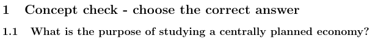
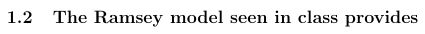
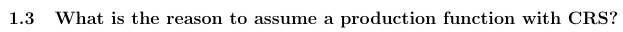
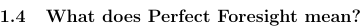
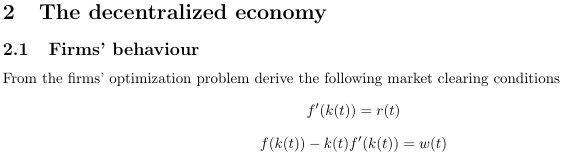

(c) To have a benchmark of the optimal outcome, under an utilitarian perspective, against which to compare the market economy outcome.

(d) A framework to study the long-term trend of consumption, capital, the wage rate and of the interest rate.

(a) It is inconsistent to assume perfect competition without assuming CRS.

(c) Households are able to anticipate the future path of the interest rate and wages, given the exogenous variables.

The problem of a firm can be written as:
$$\underset{K,L}{\max} F(K,AL)-wL-rK.$$

The FOC are:

1. $\partial F(K,L)/\partial K - r = 0 \Leftrightarrow f'(k(t))=r(t)$
2. $\partial F(K,L)/\partial L - w = 0 \Leftrightarrow \partial F(K,L)/\partial L = w(t) $
