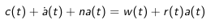
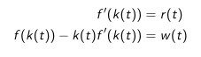
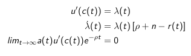
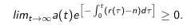

Solutions of the ramsay model are characterized by:
1. $\frac{\dot{c}_t}{c_t}=\sigma(c_t)$
2. $\dot{k}_t$
3. $\lim$

*Trasnversality condition* - the value of capital in infinity should be zero as we would have liked to have enjoyed it.

Given that we have a system of non-linear differential equations.

To get to the solution we will use an heuristic. By looking at the steady-state, a point where $\dot{c}_t=0$ and $\dot{k}_t=0$. We have that:
- $\dot{c}_t=0\implies f'(k)=n+\gamma$
- $\dot{k}_t=0\implies c =f(k)-nk$

We would like to plot the points where consumption doesn't change in a graph with axis k (as x) and c (as y). Let us assume that:
1. $f(k)=k^\alpha$
2. $f'(k)=\alpha k^{\alpha -1}$

Saddle path is the characterization of the solution.

The last condition allows us to exclude the equilibria that go to the x-axis where we have too much capital. The first condition allows us to disregard to the equilibria that end up at y-axis as the MPK is bigger than $n+\rho$.

You study business cycles by looking at the behaviour around the steady state. You can do linear approximations for ease of work.

______

In a decentralized economy, prices are taken, the rates of return are fixed, and instead of having a social planner, it is the market that twists the decisions of households via prices. Competitive forces make the prices such that who is asking for capital asks the same value that is available from agents.

Rental market is being introduced so that we start thinking about private debt.

The dynamic budget constraint:
 
$-b_p$ is the private debt.

In a closed economy, if we have a debt, the other person on the economy as the opposite. In this circumstance, net supply of private debt is zero.

$r(t)a(t)$ return on your assets.

The problem of a firm can be written as:
$$\underset{K,L}{\max} F(K,L)-wL-rK.$$
Given this, the homework is to derive:

We use use the Hamiltonian to get:

We have to constrain $a(t)$, the financial assets, in some way so that agents don't borrow a shit amount of money to pay for $r(t)$, the interest rate, and $n$, the growth of my household. This constraint says that the $a(t)$ discounted has to be equal to $0$. We cannot increase debt at a faster rate than $r+n$. This is the *No Ponzi* condition:

The dynamic budget constraint is just between two periods: $\dot{a}(t)+n(t)a(t)-r(t)a(t)+c(t)=w(t)$.
