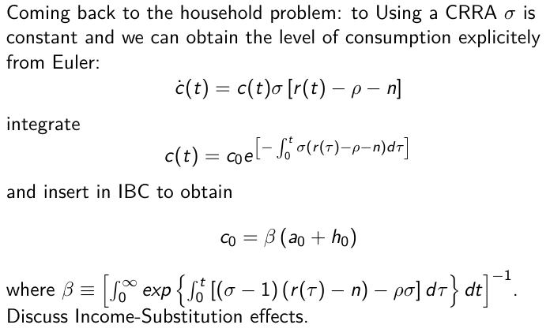
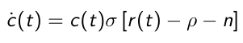
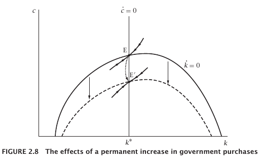
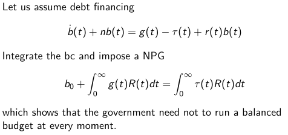
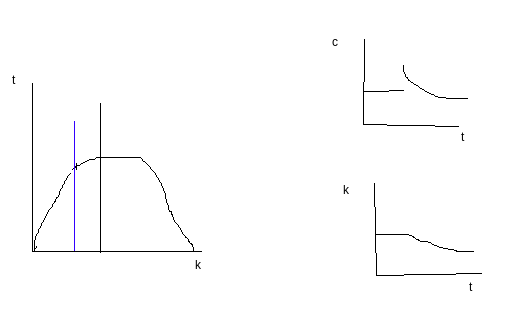

We are going to check the tricks to solve the integration of budget constraints. Remember that what we had is always something that says that
Budget constraint of the household (the dynamic budget constraint with consumption + assets equaling income):
$$c_t+\dot{c}_t+na_t=w_t+r_ta_t$$

We want to integrate this into an intertemporal budget constraint. We are looking at a differential equation. How to solve this? How do er integrate?

Let us assume that $r$ is constant:
1. constant coefficients on the variable to be integrated.

$$\dot{a}_t-(r-n)a_t=w_t-c_t, \text{(we multiply by the integrating factor }e^{-(r-n)t}\text{)}$$
$$\int^T_0\left[\dot{a}-(r-n)a_t\right]e^{-(r-n)t}d_t$$

Notice that $\frac{d\left(a_te^{-(r-n)t}\right)}{dt}=\dot{a}-(r-n)a_t$.

$$\left|a_te^{-(r-n)t}\right|^T_0=a_te^{-(r-n)t}-a_0$$

So the IBC for $T\to\infty$:

$$\int_0^\infty c_t^{-(r-n)t}dt=a_0+\int_0^\infty w_t^{-(r-n)t}dt$$

Where $h_0=\int_0^\infty w_t^{-(r-n)t}dt$.

Let us check for $r$ varying:

$$\dot{a}_t-(r-n)a_t=w_t-c_t, \left(\text{we multiply by the integrating factor }e^{-\int_0^T(r_\tau-n)d\tau}\right)$$

$$\int^T_0\left[\dot{a}-(r_t-n)a_t\right]e^{-\int_0^T(r_\tau-n)d\tau}d_t=\int_0^T(w_t-c_t)e^{-\int_0^T(r_\tau-n)d\tau}dt$$

Notice that $\frac{d\left(a_t^{-\int_0^T(r_\tau-n)d\tau}\right)}{dt}$.

We get:

...

From now on:
$$R_t=e^{-\int_0^T(r_\tau-n)d\tau}$$

________________

My consumption is a propensity to consume ho to my financial and human wealth that depend on  $\beta$. The effect of sigma controls the strenght of the interest rate in to the consumption: interest rate and substitution effect.

If $\sigma$ is higher than 1 we have substitution effect as $\beta$ goes down with an increase in the interest, if lower we have income effect. The wealth effect comes from $h_0$. This $\beta$ is the propensity to consume out of wealth. It depends on the path of $r_t$. To choose consumption, I need to form an expectation on the future path of interest. Here, the expectations match reality.

So, the constant elasticity of substitution tells us how strong the effect of interest in the Euler:

In the formulation:

_______

Let us introduce taxes and the government.

1. Add $g_t$, public expenditure,  with balance budget every period:

$$g_t=\tau_t$$

Given this equality, we can substitute them in the new budget constraint and arrive at the fact that the present value of consumption equals the present value of human wealth minus the present value of government consumption.

If we solve the model again, we will have:

$$\dot{k_t}=f(k_t)+c_t-nk_t-g_t$$

How does government consumption affect the path of the economy?

We have a complete crowding-out. Here, the expensiture is financed with a lump-sum tax.

Let us now use public debt: $b_t$.

Impose a Non-ponzi condition (NPC) so that public debt is ssustainable:

$$\lim_{t\to\infty}b_te^{-\int_0^t\left(r_\tau-n\right)d\tau}=0$$

Let us plug this into the individual lbudget constraint.

From the intertemporal budget constraint, for a given path of public expenditure it is irrelevant, as long as a non-ponzi condition holds, to finance $g$ with $\tau$ or $b$. This is the Ricardian equivalence. Just because they are forward looking, for a given path of $g$, if it is not financed today, it will have to be financed tomorrow.

$$\int_0^\infty c_tR-tdt=a_o+h_0-\int_o^\infty g_tR_tdt$$

________________

Let us do 2 exercises. The first exercise is the problem of an increase of the time preference. An increase in $\rho$. A decrease in the willigness to save. How do we study such change. Does We should prepare:
1. a permanent increase in $\rho$ is unexpected
- $\dot{k}_t=f(k_t)-nk_t-c_tR$ \text{ (nothing changes here)}
- $\frac{\dot{c}_t}{c_t}=\sigma\left[f'(k_t)-\rho-n\right]$: $c=0\implies f'(k_t)=\rho+n$

First I consume more and then I keep having lower capital as I'm saving less. For this reason, consumption also has to go down.

