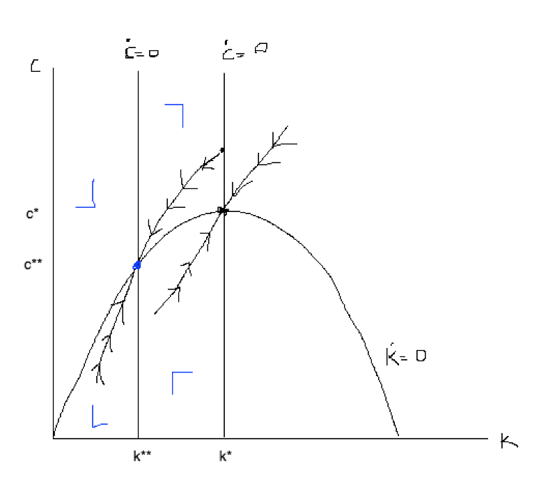
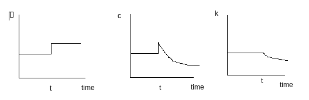
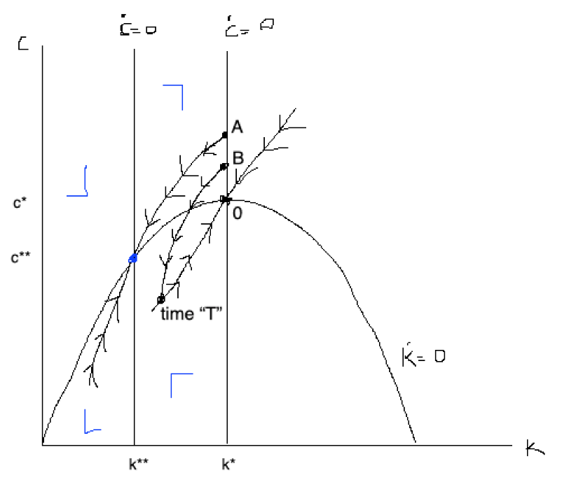
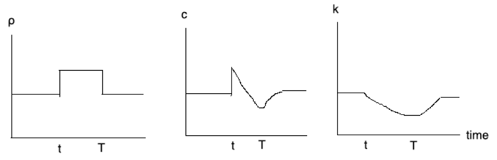
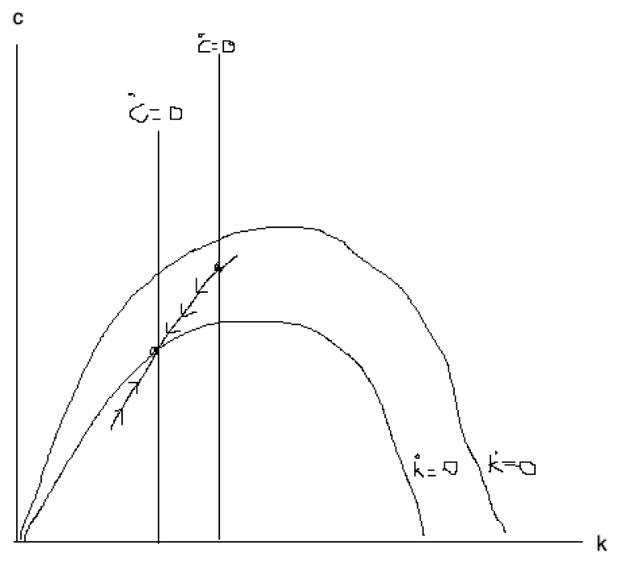
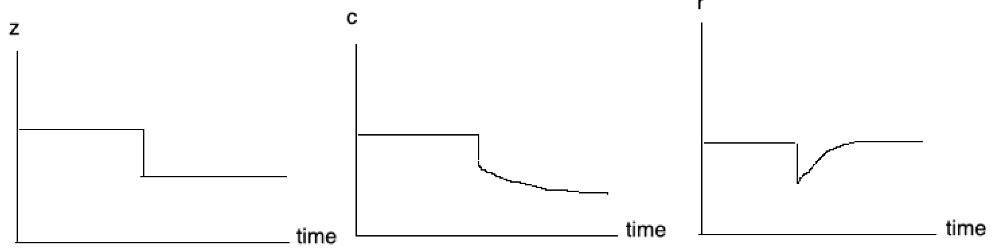

We are coming back to the change in the willingness to save.

Our old friends are:
\[\frac{\dot{c}}{c}=\sigma\left[f'(k)-\rho-n\right],\]
and
\[\dot{k}=f(k)-nk-g\]

Our exercise is to study a world where everyone becomes more impatient.

**I) a permanent increase in $\rho$**

The interpretation of the consequence in the first expression is that we need a higher rate of return of capital to stop consuming.

The solution method:
1. How does the steady state change?
$c^*\to c^{**},\ k^*\to k^{**}$ and the new solution is the blue saddle point.

2. How do I go from there?
2.1 $c$ can jump, $k$ cannot jump
2.2 $c$ after an initial jump remains smooth

In the last class we checked that:

\[c_t=\beta(h_t+a_t),\]
\[\beta=\left[\int_t^\infty e^{\int_\tau^s \left[(\sigma-1)(r(\tau)-n)-\rho(\tau)\sigma\right]d\tau}ds\right]^{-1},\]
\[h_t=\int^\infty_t e^{-\int_t^\tau\left(r(s)-n\right)ds}w(\tau)d\tau,\]

The effects are:
- $\rho\uparrow\Rightarrow B\uparrow \Rightarrow c_t\uparrow$ [partial equilibrium initial effect]
- if $c\uparrow\Rightarrow\dot{k}<0\Rightarrow k\downarrow$
- if $k\downarrow\Rightarrow r\uparrow, w\downarrow\Rightarrow h_t\downarrow$ and $\beta\uparrow(\text{or }\downarrow)$ if $\sigma>(<)1$.

**II) a temporary increase in $\rho$**

First, let us study the steady state and the phase diagram:

The time paths are:

_______

Let us study a permanent technological shock $z$ going down.

Given the conditions from before:
- $z\downarrow\Rightarrow w\downarrow \Rightarrow c\downarrow$
- $z\downarrow\Rightarrow zf(k)\downarrow\Rightarrow c\downarrow$
- $z\downarrow\Rightarrow r\downarrow$
- $k\downarrow\Rightarrow r\uparrow$

For a temporary shock of $z$, the analysis is similar to the one before. There will be a blue and black dynamic.

Cool analysis to check:
1. $z$
2. $n$
3. $\tau$ - taxes on capital (profits) [very similar to a $z$ shock]

________________

Two costate, 4 FOC,
