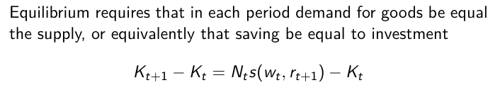
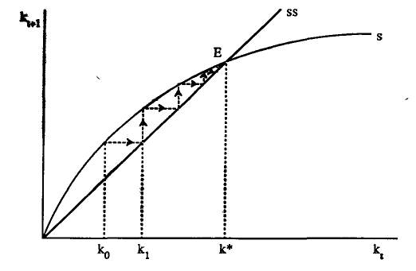
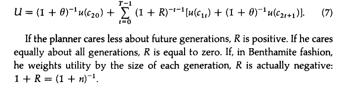

$c_{1t}$ consumption when young
$c_{2t+1}$ consumption when old

These are the types of agents in the economy. We can see that there is no representative agent.

The Lagrangian of this problem is

$\mathcal{L}=u(c_{1t})+(1+\rho)^{-1}u(c_{2t+1})+\lambda_1\left[w_t-c_{1t}-s_t\right]+\lambda_2\left[\left(1+r_{t+1}\right)s_t-c_{2t+1}\right]$

F.O.C.:

$\frac{\partial \mathcal{L}}{\partial c_{1t}}=u'(c_{1t})-\lambda_1=0$

$\frac{\partial \mathcal{L}}{\partial c_{2t+1}}=(1+\rho)^{-1}u'(c_{2t+1})-\lambda_2=0$

$\frac{\partial \mathcal{L}}{\partial s_t}=-\lambda_1+\lambda_2\left(1+r_{t+1}\right)=0$

By manipulating them we get:

Where $s$ becomes an implicit function on $w_t$ and $r_{t+1}$.

The good old friend:

$u'(c_{1t})=(1+\rho)(1+r_{t+1})u'(c_{t+1})$

If the wage increases, saving increases. Income effect. Depending on $r_{t+!}$, it depends.

The demand of savings equals the demand of capital.

 And, therefore,

 With $I_{t}$ on the left of the equality, and $S_{t}$ on the right. $N_t$ is the number of indiciduals and we subtract $K_t$ which is the depreciated capital $(\delta=1)$.

 By diving the expression by $N_t$, we get

 

 which can be rearranged to

 

 ## What do we know about this equilibrium?

 The steady state is where $k_t=k_{t+1}$.

 In non linear difference equations, we can have:
 - multiple equilibria
 - stable or unstable

The condition before makes sure that the equilibria are stable.

Let us derive this condition:

$(1+n)k_{t+1}=s\left(f(k_t)-k_tf'(k_t), f'(k_{t+1})\right)$

$(1+n)dk_{t+1}=s_w\left[f'(k_t)-f'(k_t)-k_tf''(k_t), f'(k_{t+1})\right]dk_t+s_rf''(k_{t+1})dk_{t+!}$

$(1+n)dk_{t+1}=-s_w\left[k_tf''(k_t), f'(k_{t+1})\right]dk_t+s_rf''(k_{t+1})dk_{t+!}$

What is the economic intuition? We want agents to have the right effects to continue to add $k$, when $k$ goes up in the period before.

For the equilibrium to exist, for the steady-state to be locally stable, we must verify:

![](assets/mt_20190218-611aed98.png

The dynamic adjustment can be seen as:

We have just investigated the competitive equilibrium of the economy.

**CHECK SOCIAL CHOICE AND THE PROBLEMS OF WEIGHTING GENERATIONS**

This is just an example of the utility function that the the central planner might have:

This is the welfare of the social planner

The utility of the present generation:

$R$ is the factor by which the planner values each generation. The social discount factor.

$c_{20}$ corresponds to the consumption of the agents that were born last period.

We solve using the resource constraint of the economy.

