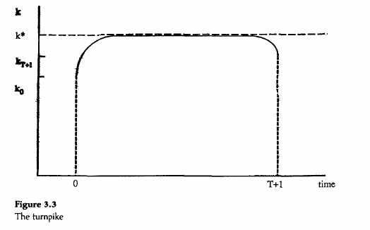
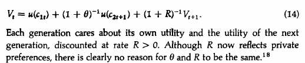
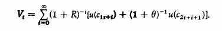
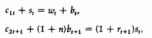

The steady state in the decentralized economy with a star, we did something like this:

$$k^*(1+r)=s\left(f(k^*)-k^*f'(k^*),f'(k^*)\right)$$

In the modified golden rule...

First we have the starting generation: $(1+\rho)^{-1}u(c_{20})$

The social planner can put some weight, $R$, across generations on the private utility of each generation - where each generation lives 2 periods. If they are young they have the utility $u(c_{1t})$, and if they are old they have utility $(1+\rho)^{-1}u(c_{2t+1})$.

The problem with the economy's budget constraint is the folowing and the social planner maximizes by choosing the initial $k$:

$\mathcal{L}=(1+\rho)^{-1}u(c_{20})+\sum_{i=o}^{T-1}(1+R)^{-t-1}\left\{ \left[u(c_{1t})+(1+\rho)^{-1}u(c_{2t+1}) \right]+\lambda_t\left[k_t+f(k_t)-(1+r)k_{t+1}-c_{1t}-(1+r)^{-1}c_{2t}\right]\right\}$

There are 4 FOC conditions:
1. $\quad c_{20}: \quad (1+\rho)^{-1} u'(c_{20}) = \lambda_t (1+n)^{-1}$
2. $\quad c_{1t}: \quad u'(c_{1t}) = \lambda_t$
3. $\quad c_{2t+1}: \quad (1+\rho)^{-1} u'(c_{2t+1}) = (1+R)^{-1} \lambda_{t+1}(1+n)^{-1} $
4. $\quad k_{t+1}: \quad (1+n)\lambda_t = (1+R)^{-1} \lambda_{t+1} \left[ 1 + f'(k_t{t+1}) \right]$

The conclusions are:
- $1 + 2$ -> intra temporal
- $2+4$ -> inter temporal
- $2+3+4$ -> the same as before

In the steady state:
$c_1^*,c_2^*, k^*$

The social planner gets to the modified golden rule:
$$\left[1+f'(k^*)\right]=(1+r)(1+R)$$

Turnpike: the optimal behavior of allocation is to stay close to the steady state as long as possible.

The resource constraint at the steady state is $f'(k^*)-nk^*=c^*$. What happens if I increase or decrease $k$ at the steady state?

$\frac{dc^*}{dk^*}=\left[f'(k^*)-n\right]<0\implies$ by decreasing $k^*$, you have permanently higher $c^*$. The economy is dynamically inefficient.

__________

By looking at:

we write a new budget constraint:

$\lambda_{1t}(w_t+b_t-s_t-c_{1t})+\lambda_{2t}\left(s_t(1+r_{t+1})-c_{2t+1}-(1+n)b_{t+1}\right)+N_tb_{t+1}$

Where $b_{t+1}\geq0$, as the bequest must be positive, $N_tb_{t+1}=0 \left\{\begin{matrix}
b_{t+1}>0 \implies N_t =0\\
b_{t+1}=0 \implies N_t >0
\end{matrix}\right.$

Results I) in steady state you get

$$
\left\{\begin{matrix}
(1+r) = (1+n)(1+R), \text{ if }b>0\\
(1+r) \leq (1+n)(1+R), \text{ if }b=0
\end{matrix}\right.
$$

____________

There are 2 ways of paying for social security:
1. Fully funded system - the government or someone says that you need to save. These savings will be invested in the economy and you will get the returns for your retirement.
2. Pay as you go system - historically, you needed a way to start a system. This is a transfers program.

With FF programs, capital stock is unaffected:

$$s_t+d_t=(1+n)k_{t+1}$$

With PAYG,
$$s_t=(1+n)k_{t+1}$$

The saving function is now $s(w_t, r_{t+1}, d_t)$. This is a partial equilibrium exercise.

$$\left|\frac{\partial s}{\partial d}\right|\lessgtr1\text{, depends on }r\gtrless n$$
