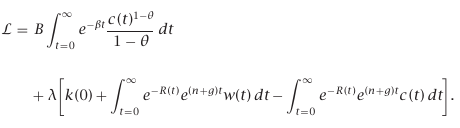
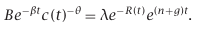
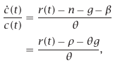
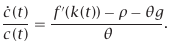
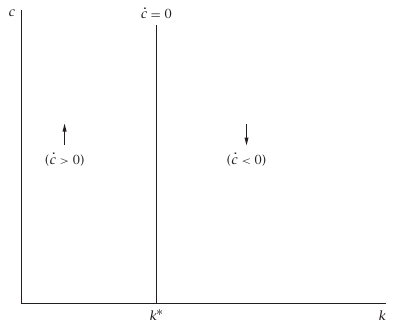
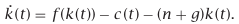
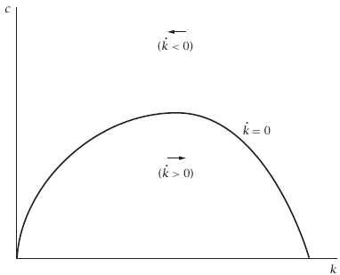
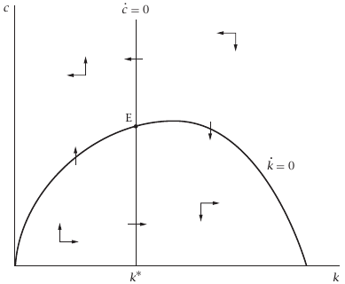

Greeks:
- $\rho$ is the discount rate. The greater the $\rho$, the less the household values future consumption relative to current consumption;
- $\theta$ determines the household's willingness ti shift consumption between different periods. When $\theta$ is smaller, marginal utility falls more slowly as consumption rises, and so the household is more willing to allow its consumption to vary over time. If $\theta$ is close to zero, for example, utility is almost liner in $C$, and so the household is willing to accept large swings in consumption to take advantage if small differences between the discount rate an the rate of return on saving. Specifically, one can show that the elasticity of substitution between consumption at any two points in time is $1/\theta$;
- $g$ is the rate at which $A$ grows;
- $r$ is the real interest rate.

________________

## 2.2 The Behavior of Households and Firms

### Household Behavior

The household's problem is to choose the path of $c(t)$ that maximize lifetime utility subject to the budget constraint. Although this involves choosing $c$ at each instant of time (rather than choosing a finite set of variables, as in standard maximization problems), conventional maximization techniques can be used. Since the marginal utility of consumption is always positive, the household satisfies its budget constraint with equality. The Lagrangian of this problem is as follows:

The household chooses c at each point in time; that is, it chooses infinitely many $c(t)$'s. The first-order condition for an individual $c(t)$ is:

The *Euler equation* for this problem is

where the second line uses the definition of $\beta$ as $\rho-n-(1-\theta)g$. An intuitive way of deriving this equation is to think of the household's consumption at two consecutive moments in time. Specifically, imagine the household reducing $c$ at some date $t$ by a small (formally, infinitesimal) amount $\Delta c$, investing this additional saving for a short (again, infinitesimal) period of time $\Delta t$, and then consuming the proceeds at time $t+\Delta t$: assume that when it does this, the household leaves consumption and capital holdings at all times other than $t$ and $t+\Delta t$ unchanged. If the household is optimizing, the marginal impact of this change on lifetime utility must be zero. If the impact is strictly positive, the household can marginally raise its lifetime utility by making the change. And if the impact is strictly negative, the household can raise its lifetime utility by making the opposite change.

Intuitively, the *Euler equation* describes how $c$ must behave over time given $c(0)$: if $c$ does not evolve according to the *Euler equation*, the household can rearrange its consumption in a way that raises its lifetime utility without changing the present value of its lifetime spending. The choice of $c(0)$ is then determined by the requirement that the present value of lifetime consumption over the resulting path equals initial wealth plus the present value of future earnings. When $c(0)$ is chosen too low, consumption spending along the path satisfying the *Euler equation* does not exhaust lifetime wealth, and so a higher path is possible; when $c(0)$ is set too high, consumption spending more than uses up lifetime wealth, and so the path is not feasible.

## 2.3 The Dynamics of the Economy

### The Dynamics of $c$

Since all households are the same, the *Euler equation* describes the evolution of $c$ not just for a single household but for the economy as a whole. Since $r(t)=f'(k(t))$, we can rewrite it as:

Thus, $\dot{c}$ is zero when $f'(k)$ equals $\rho+\delta g$. Let $k^*$ denote this level of $k$. When $k$ exceeds $k^*$, $f'(k)$ is less than $\rho+\delta g$, and so $\dot{c}$ is negative; when $k$ is less than $k^*$, $\dot{c}$ is positive.

### The Dynamics of $k$

As in the Solow model, $\dot{k}$ equals actual investment minus break-even investment. Since we are assuming that there is no depreciation, break-even investment is $(n+g)k$. Actual investment is output minus consumption, $f(k)-c$. Thus,

For a given $k$, the level of $c$ that implies $\dot{k} = 0$ is given by $f(k) − (n + g)k$; $\dot{k}$ is zero when consumption equals the difference between the actual output and break-even investment lines. This value of $c$ is increasing in $k$ until $f'(k) = n + g$ (the golden-rule level of $k$) and is then decreasing. When $c$ exceeds the level that yields $\dot{k} = 0$, $k$ is falling; when $c$ is less than this level, $k$ is rising. For $k$ sufficiently large, break-even investment exceeds total output, and so $\dot{k}$ is negative for all positive values of $c$.

### The Phase Diagram

The figure is drawn with $k^*$ (the level of $k$ that implies $\dot{c} = 0$) less than the golden-rule level of $k$ (the value of $k$ associated with the peak of the $\dot{k} = 0$ locus). To see that this must be the case, recall that $k^*$ is defined by $f'(k^∗) = \rho + \theta g$, and that the golden-rule $k$ is defined by $f'(k_{GR}) = n + g$. Since $f''(k)$ is negative, $k^*$ is less than $k_{GR}$ if and only if $\rho + \theta g$ is greater than $n + g$. This is equivalent to $\rho − n − (1 − \theta)g > 0$, which we have assumed to hold so that lifetime utility does not diverge. Thus $k^*$ is to the left of the peak of the $\dot{k} = 0$ curve.

